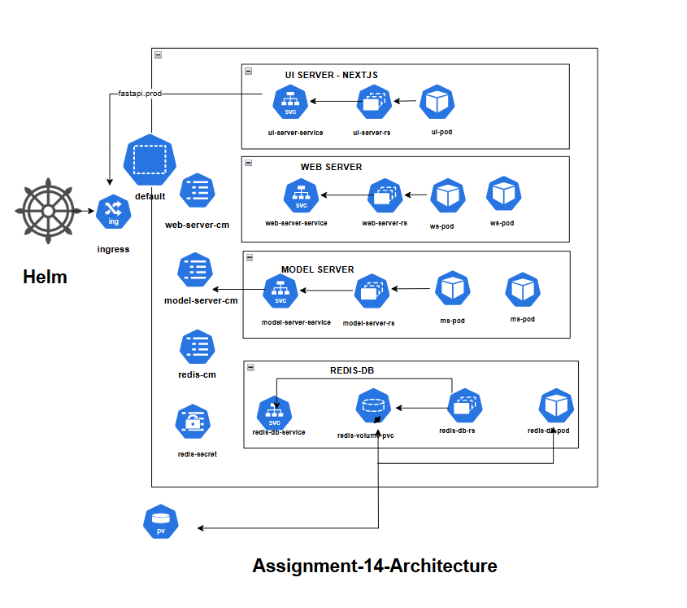
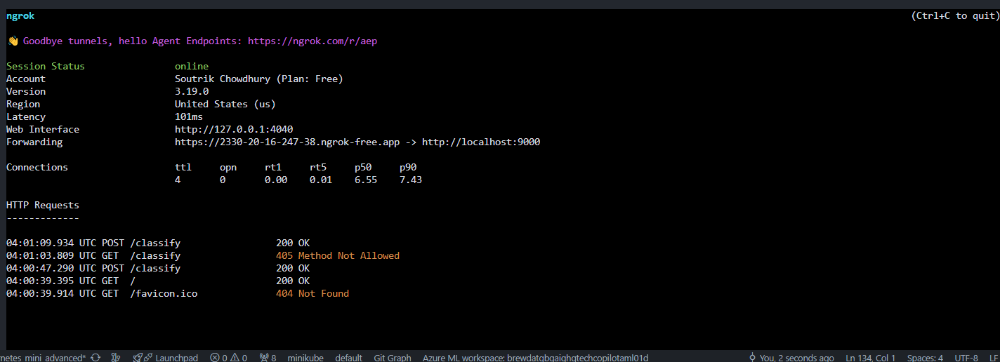
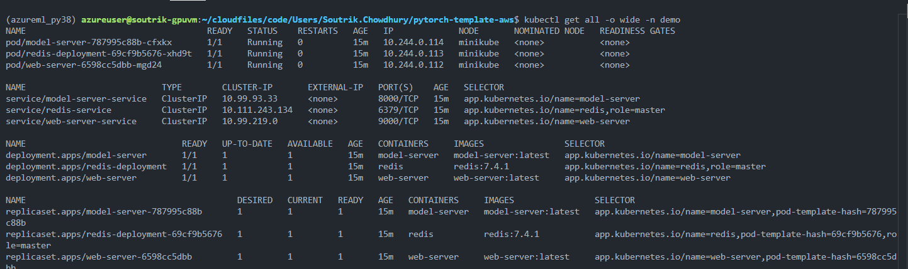
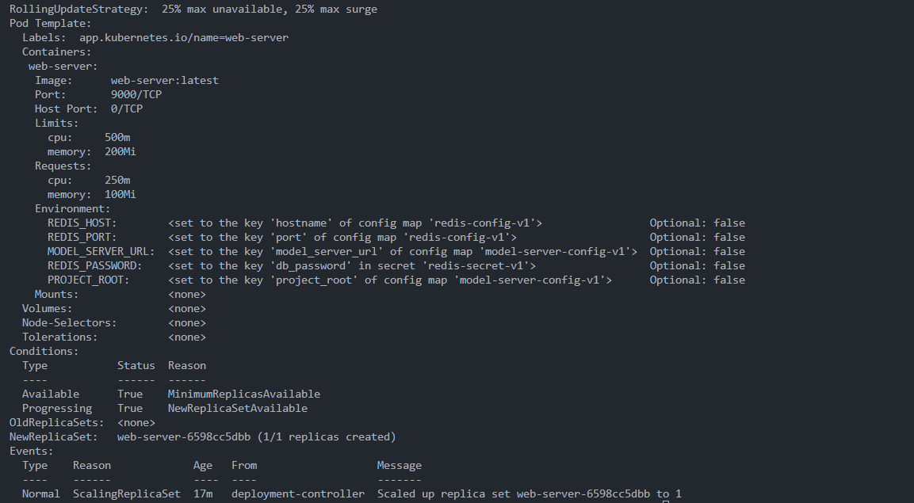
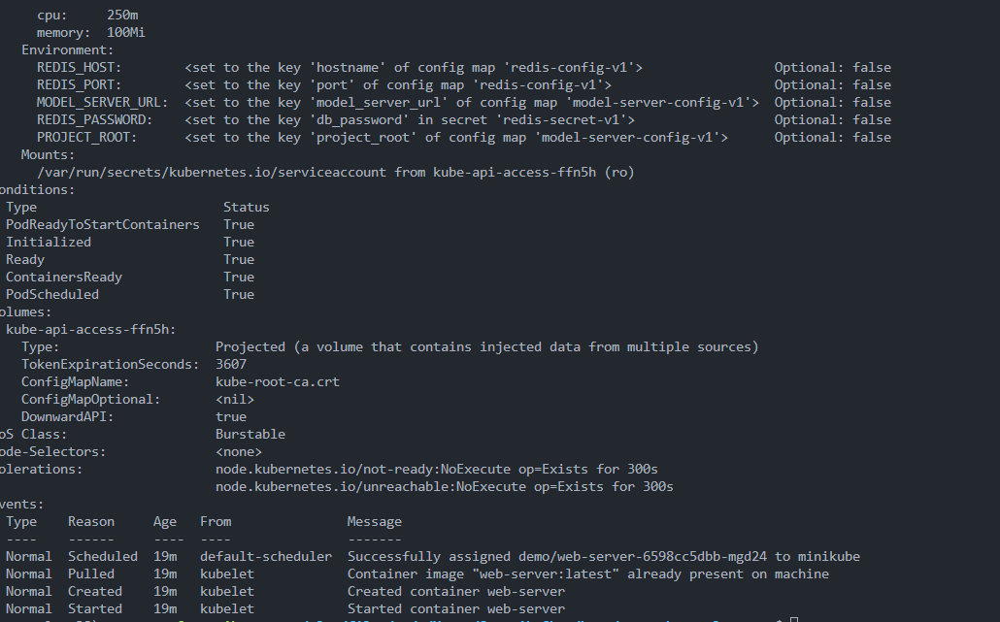
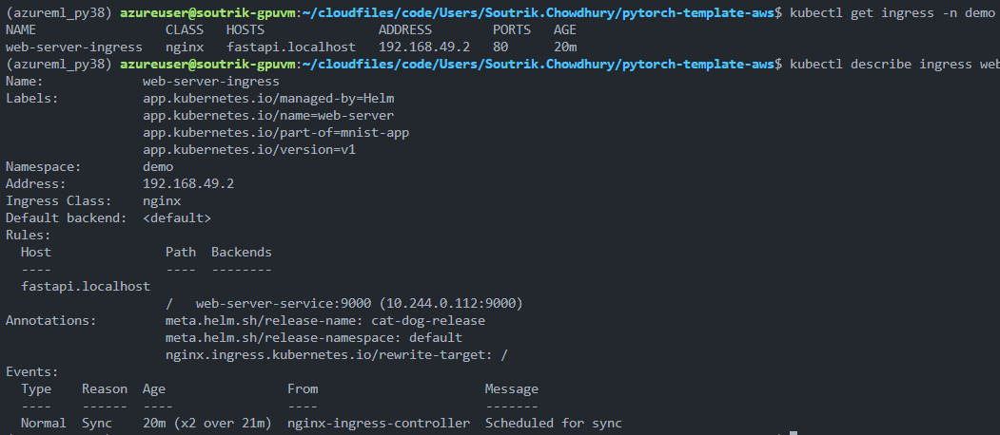
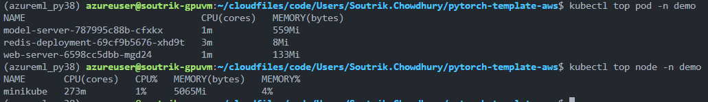

## EMLOV4-Session-14 Assignment - Kubernetes - II: Ingress, ConfigMap, Secrets, Volumes and HELM

### Problem Statement:

Using Helm charts, we are deploying a `cat-dog model service` hosted on a FastAPI server. Alongside, a `backend service built with FastAPI` handles requests. The `NextJS UI service` functions as the front-end interface for users. Additionally, a `Redis caching service` is integrated to enhance performance. Finally its exposed to internet with `ngrok`

### Requirements:

- Design a deployment to deploy the Cat/Dog or Dog Classifier on K8S
    - You must first create a architecture diagram and show all pods, replicasets, deployments, service, ingress, volumes and nodes that will be involved in this deployment
    - Use diagrams.netLinks to an external site. for the diagram
    - write the code for model server, web server and test it with docker-compose first
    - you must be using a redis cache for inference results caching
    - create k8s manifests for the same
    - You’ll need to figure out the peak cpu and memory usage with kubectl top pod
- Deploy on K8S using the manifests
- Create HELM Chart with configurable values
- Deploy with HELM
- You must use minikube either on your local machine or on an EC2 instance
- What to Submit?
    - Github Repo with Deployment YAML Files
    1. Instructions to
        - Deploy using HELM Chart
        - Tunnel to the Ingress
        - Screenshot of the fastapi docs page with one inference done
    2. Output of the following in a .md file in your repository
        - kubectl describe <your_deployment>
        - kubectl describe <your_pod>
        - kubectl describe <your_ingress>
        - kubectl top pod
        - kubectl top node
        - kubectl get all -A -o yaml

**BONUS**
- Use ngrok ingress to expose your deployment to internet
-  UI Created using FastHTML framework

#### Architecture Diagram:



#### Steps to Deploy:
##### Docker compose based deployment:
```bash
# first create the model-server folder and the corresponding files like Dockerfile, requirements.txt, server.py
# then create the web-server folder and the corresponding files like Dockerfile, requirements.txt, server.py
# then create the docker-compose.yml file
# Add PROJECT_ROOT to the model-server and web-server services in your docker-compose.yaml:

docker-compose up -d --build redis
docker-compose up -d --build model-server
docker-compose up -d --build web-server
```
##### MiniKube based deployment:
```bash
minikube start --driver=docker
alias kubectl="minikube kubectl --"
eval $(minikube docker-env)
docker build -t model-server:latest -f model-server/Dockerfile .
docker build -t web-server:latest -f web-server/Dockerfile .
eval $(minikube docker-env -u)
cd K8s/
kubectl apply -f . -n default
kubectl get all -n default -o wide
minikube service web-server-service
minikube tunnel
kubectl port-forward service/web-server-service 9000:9000
kubectl delete all --all -n default
```
##### Helm based deployment(Non-namespace specific):
```bash
helm create cat-dog-model
rm -rf cat-dog-model/templates/*
cp -r k8s/* cat-dog-model/templates/
# remove values.yaml and delete all existing deployment, service, ingress and secrets in the minikube cluster
kubectl delete deployment,service,ingress,secrets --all -n default
kubectl delete secret --all -n default
kubectl delete pv --all -n default
kubectl delete pvc --all -n default
kubectl delete ingress web-server-ingress -n default
kubectl delete all --all -n default
# add {{Release.Name}} in the deployment, service, ingress and secrets files for namespace
# even if you get error, then create a separate namespace and deploy the helm chart
kubectl create namespace cat-dog-nm
helm install cat-dog-release cat-dog-model -n cat-dog-nm
helm uninstall cat-dog-release -n cat-dog-nm
minikube service web-server-service -n cat-dog-nm
minikube tunnel
kubectl port-forward service/web-server-service 9000:9000 -n cat-dog-nm
helm uninstall cat-dog-release -n cat-dog-nm
# additional commands: kubectl config set-context --current --namespace=cat-dog-nm, this will set the namespace for the current context
``` 
Here I don't have any values specified in the values.yaml file, but we will add namespace specific values in the values.yaml file later.
##### Service deployment

##### Tunnel deployment


##### Helm based deployment(Name-space specific):
```bash
# we create values.yaml file with namespace specific values and then deploy the helm chart
# We also create namespace.yaml file to create the namespace specific to the deployment
helm install cat-dog-release cat-dog-model -f cat-dog-model/values.yaml
helm upgrade cat-dog-release cat-dog-model -f cat-dog-model/values.yaml
helm list -a
kubectl get all -o wide -n demo
minikube service web-server-service -n demo
minikube tunnel
kubectl port-forward service/web-server-service 9000:9000 -n demo
helm uninstall cat-dog-release
```
##### Service deployment


##### Tunnel deployment


#### Bonus Assignment adding Ngrok:
```bash
# install ngrok on your local machine
curl -sSL https://ngrok-agent.s3.amazonaws.com/ngrok.asc \
	| sudo tee /etc/apt/trusted.gpg.d/ngrok.asc >/dev/null \
	&& echo "deb https://ngrok-agent.s3.amazonaws.com buster main" \
	| sudo tee /etc/apt/sources.list.d/ngrok.list \
	&& sudo apt update \
	&& sudo apt install ngrok

# authenticate ngrok
ngrok config add-authtoken <>
# Forward port from pod to local
kubectl port-forward service/ui-server-service  9000:9000 -n demo
#Expose the port 9000 to internet
ngrok http 9000
# additional commands:
kubectl get all -o wide -n demo
kubectl get all -o wide -n demo
kubectl describe deployment.apps/web-server -n demo
kubectl describe pods pod/web-server-6598cc5dbb-mgd24  
kubectl describe  pod/web-server-6598cc5dbb-mgd24 -n demo 
kubectl get ingress -n demo
kubectl describe ingress web-server-ingress -n demo
kubectl top pod -n demo
kubectl top node -n demo
```
##### Ngrok deployment


##### kubectl get all -o wide -n demo


##### kubectl describe <your_deployment> -n demo


##### kubectl describe <your_pod> -n demo


##### kubectl describe <your_ingress> -n demo


##### kubectl top pod & kubectl top node -n demo

